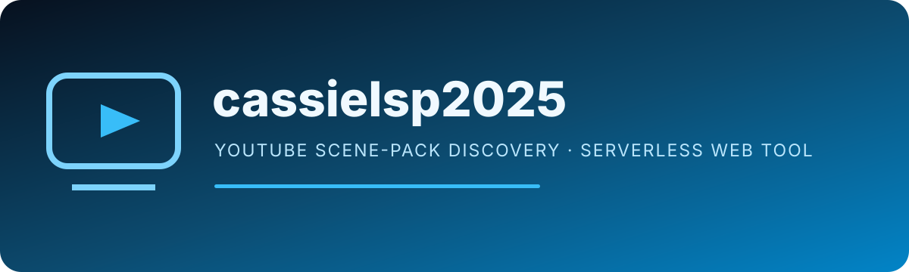

<p align="center"></p>

# cassielsp2025

A lightweight web application for discovering YouTube scene-pack videos from a search term. The browser UI sends searches to a serverless endpoint, which adds a scene-pack qualifier and queries the YouTube Data API without exposing the API key to client-side JavaScript.

## How it works

```text
User search
   |
   v
index.html + script.js
   |
   v
/api/youtube?query=...
   |
   v
YouTube Data API v3
   |
   v
Search results returned to the browser
```

The API handler in `api/youtube.js` reads `YOUTUBE_API_KEY` from the server environment. The credential is not hard-coded in the repository.

## Project structure

| Path | Role |
| --- | --- |
| `index.html` | Main browser document |
| `styles.css` | Site styling and responsive presentation |
| `script.js` | Search UI and result rendering |
| `api/youtube.js` | Serverless YouTube search proxy |
| `vercel.json` | Deployment configuration |
| `package.json` | Project metadata and dependencies |

## Configuration

Set the YouTube API key only in the deployment environment or a local ignored environment file:

```text
YOUTUBE_API_KEY=your_server_side_key
```

Do not move this value into `script.js`, query parameters, committed config files, or browser storage. If a real key is ever committed, revoke or rotate it even after removing the file from the latest branch.

## Local development

Install dependencies using the package manager defined by the project, configure `YOUTUBE_API_KEY`, and run the local development command from `package.json`. When deployed to Vercel, configure the same variable in the project environment settings.

## API behavior

`GET /api/youtube?query=<term>`:

- accepts search requests only;
- rejects missing query values;
- reads the API key from the server environment;
- requests video results from YouTube Data API v3;
- returns upstream failures as structured errors.

## Security considerations

- Keep the YouTube key server-side.
- Restrict the key in Google Cloud to only the APIs and environments that require it.
- Add rate limiting or abuse controls before exposing the endpoint to significant public traffic.
- Avoid returning unnecessary upstream error details in a production hardening pass.
- Review the current permissive CORS policy if the endpoint should only serve one frontend origin.

## Deployment

The project is structured for a static frontend plus a Vercel serverless function. After deployment, verify search behavior, error handling, and API quota usage from the production origin.
